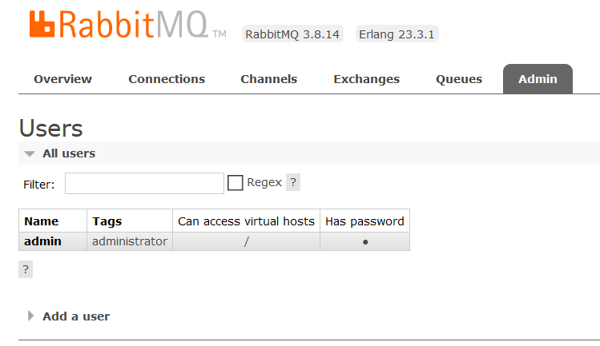
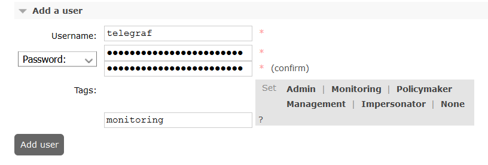
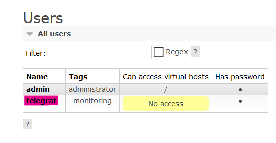
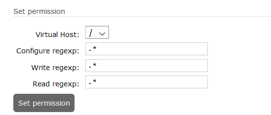
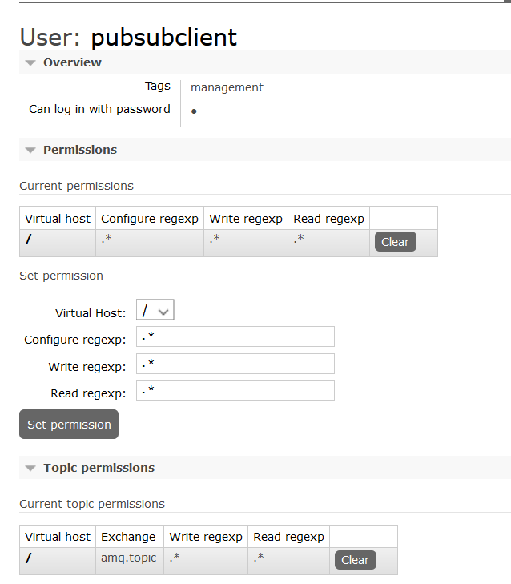
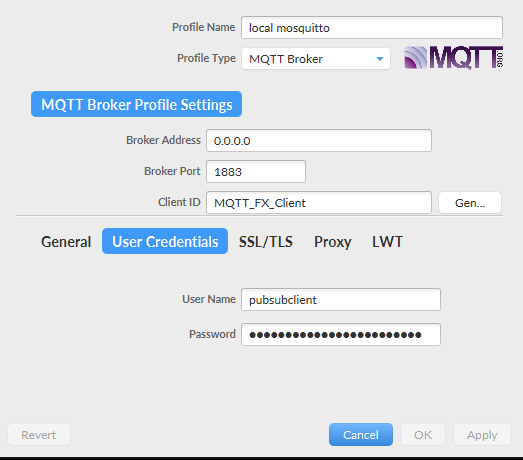
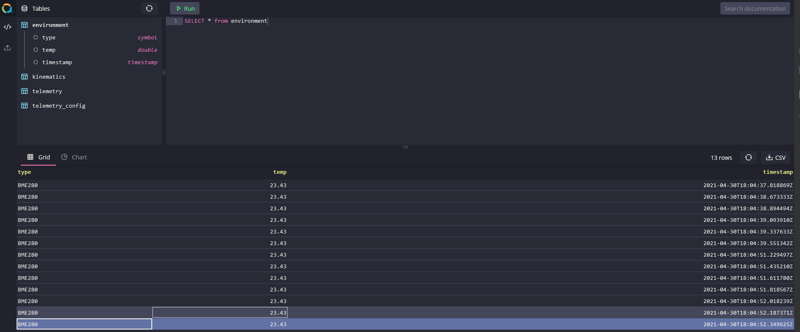

# rabbitMQuest Prototype Stack
Bring the __rabbitMQuest__ stack with basic level of security for quick prototyping.

## Configuration

1. Begin by changing the environment variables of each of the components of the stack.

    __NOTE__: _RabbitMQ__ devs do not consider it best practice to setup the broker via environment variables hence changes to it can be adapted via its respective configuration file (`rabbitmq.conf`)

2. Adapt changes to `rabbitmq.conf` for broker
3. Adapt changes to `telegraf.toml` file in order to change any other form of metric collection as well as incoming payload from the IoT sensors e.g. `json` or `influx` etc.

## Bringing the Stack up

create a docker network

    docker network create iotstack

    docker-compose -f docker-compose.prototype.yml up

add `-d` above if you wish to detach the logs

## Adding User Credentials for `telegraf` / MQTT Clients

`telegraf` as a consumer does not have any user credentials to obtain metrics and incoming MQTT payload from the broker, hence on needs to create these credentials.

As a result of this the `service` will keep on failing initially.

### Steps

1. Once the stack is up, head to `http://localhost:15672` and enter your brokers default user and password provided by you in `rabbitmq.conf`

2. Once logged in, head to the __Admin__ tab in the UI.

    

3. Click on __Add a user__ and enter the username / password according to that mentioned in the `prototype.env` and make sure to add `monitoring` tag to this user.

    

4. give the user access to virtual hosts by clicking `telegraf` above and click on __Set Permission__ to grant access to `/` virtual host

    

  
    

5. repeat the same steps as above for whatever credentials are passed in `rabbitmq.conf` (MQTT Section). The only exception should be to provide `management` Tag and `exchange` should be `amq.topic`

    


## Publishing Test

Use an MQTT Client like [MQTT.fx](https://mqttfx.org)



### Publish Topics

If you publish `IOT/sensor1/env` with an InfluxDB Line Protocol String

    environment,type=BME280 temp=23.43

This should be able to insert data into QuestDB since the following configuration is present in `telegraf.toml`

```toml
    binding_key = "IOT.#"
    data_format = "influx"
```

Adapt your `binding_key` according to your MQTT topics according to your setups.


## QuestDB Test

QuestDB is available at `http://locahost:9000`



